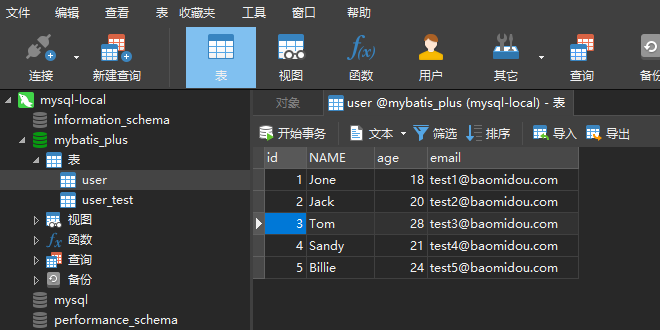

# MyBatisPlus笔记


## 环境搭建

### 前置工作

[搭建MySQL环境](https://blog.csdn.net/zhusongziye/article/details/80869125)

[安装Navicat](https://www.jb51.net/article/199525.htm)

[MyBatisPlus官方文档](https://baomidou.com/guide/#%E7%89%B9%E6%80%A7)

[学习资料1](https://www.bilibili.com/video/BV1Ds411E76Y?from=search&seid=5268324907552745421)

[学习资料2](https://www.bilibili.com/video/BV17E411N7KN?p=3&spm_id_from=pageDriver)


### 数据库初始化

```
-- 创建数据库
CREATE DATABASE mybatis_plus;

-- 使用数据库
USE mybatis_plus;

-- 创建数据库表
DROP TABLE IF EXISTS USER;
CREATE TABLE USER
(
	id BIGINT(20) NOT NULL COMMENT '主键ID',
	NAME VARCHAR(30) NULL DEFAULT NULL COMMENT '姓名',
	age INT(11) NULL DEFAULT NULL COMMENT '年龄',
	email VARCHAR(50) NULL DEFAULT NULL COMMENT '邮箱',
	PRIMARY KEY (id)
);

-- 插入测试数据
DELETE FROM USER;
INSERT INTO USER (id, NAME, age, email) VALUES
(1, 'Jone', 18, 'test1@baomidou.com'),
(2, 'Jack', 20, 'test2@baomidou.com'),
(3, 'Tom', 28, 'test3@baomidou.com'),
(4, 'Sandy', 21, 'test4@baomidou.com'),
(5, 'Billie', 24, 'test5@baomidou.com');

```

  


